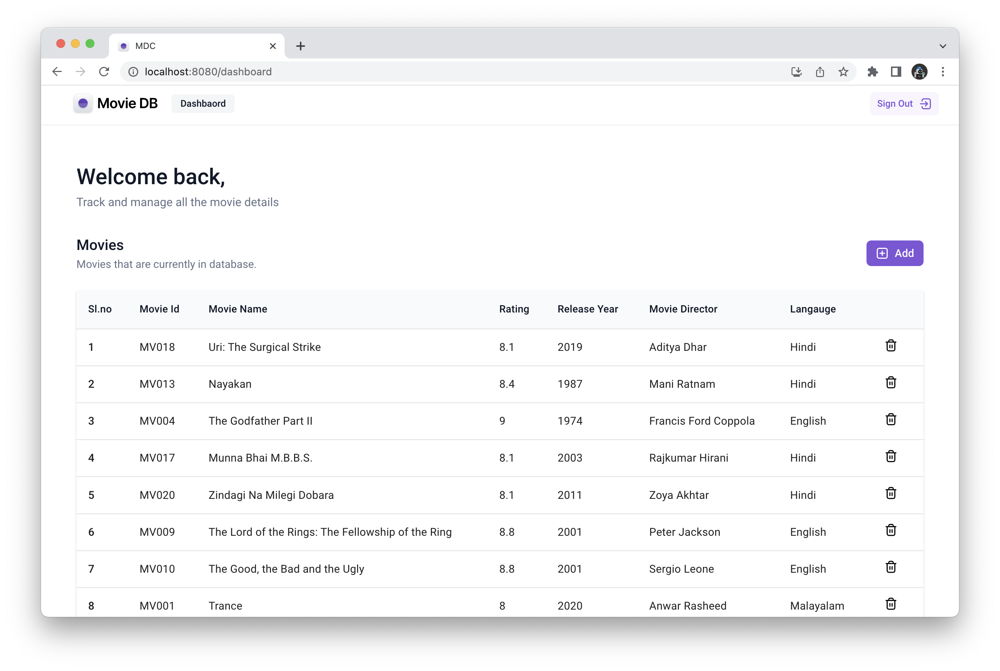

# Movie Management System

  <a href="#">About The Project</a>&nbsp;&nbsp;&nbsp;|&nbsp;&nbsp;&nbsp;
  <a href="#">Technologies</a>&nbsp;&nbsp;&nbsp;|&nbsp;&nbsp;&nbsp;
  <a href="#">Requirments</a>&nbsp;&nbsp;&nbsp;|&nbsp;&nbsp;&nbsp;
  <a href="#">Install</a>&nbsp;&nbsp;&nbsp;|&nbsp;&nbsp;&nbsp;
  <a href="#">Running the Project</a>

---

## 🚀 About the Project

 📽️ Movie DB provides a comprehensive dashboard that enables effective tracking and management of movie details for a movie distribution center.

---
## 💻 Technologies
- [React](https://react.dev/learn)
- [Express](https://expressjs.com/)
- [Nodejs](https://nodejs.org/en/docs/) 
- [Material UI](https://mui.com/material-ui/getting-started/overview/)
- [RadixUI](https://www.radix-ui.com/docs/primitives/overview/introduction)

---
## 🧰 Requirements

For development, you will only need Node.js and a node global package installed in your environement.

### Node
- #### Node installation on Windows

  Just go on [official Node.js website](https://nodejs.org/) and download the installer.
  Also, be sure to have `git` available in your PATH, `npm` might need it (You can find git [here](https://git-scm.com/)).

- #### Node installation on Ubuntu

  You can install nodejs and npm easily with apt install, just run the following commands.

      $ sudo apt install nodejs
      $ sudo apt install npm

- #### Other Operating Systems
  You can find more information about the installation on the [official Node.js website](https://nodejs.org/) and the [official NPM website](https://npmjs.org/).

If the installation was successful, you should be able to run the following command.

    $ node --version
    v8.11.3

    $ npm --version
    6.1.0

---

## ⚙️ Install
After installing node and npm run the following commands to clone the repo and install all the dependencies that is used for this application.

    $ git clone https://github.com/BrinsilElias/MovieDB.git
    $ cd MovieDB
    $ npm install

##  Running the project
After installing all the node modules run the below command to start the server. The server runs on port 3000 so after starting the server visit http://localhost:8080.

    $ npm start

---

